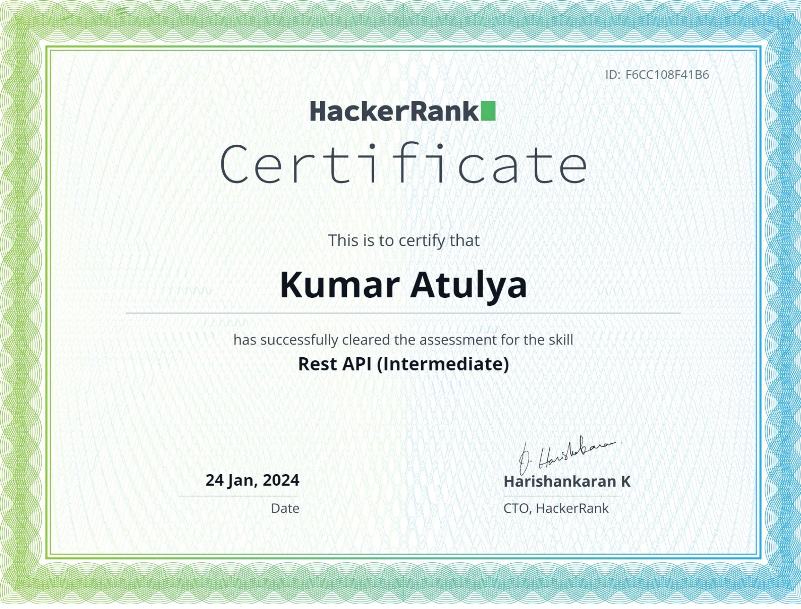
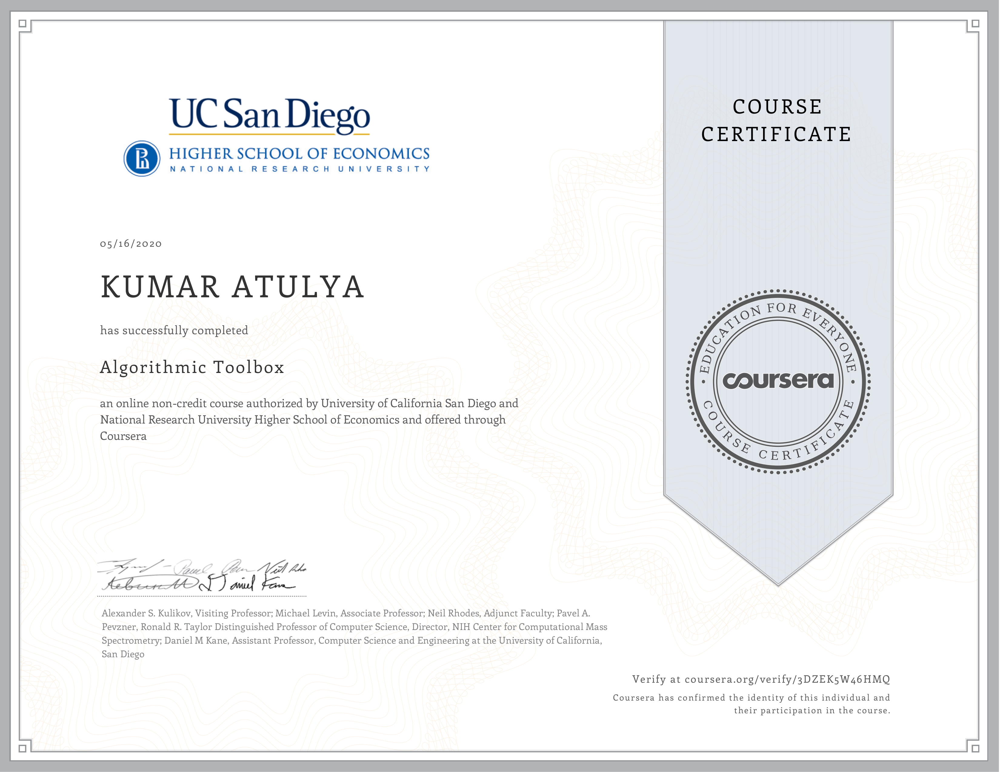
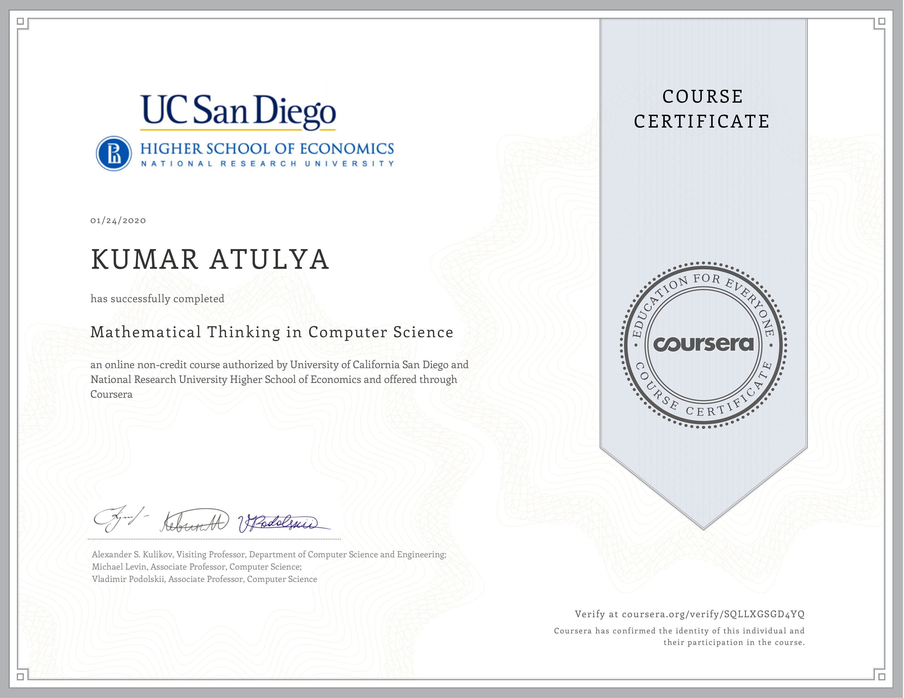
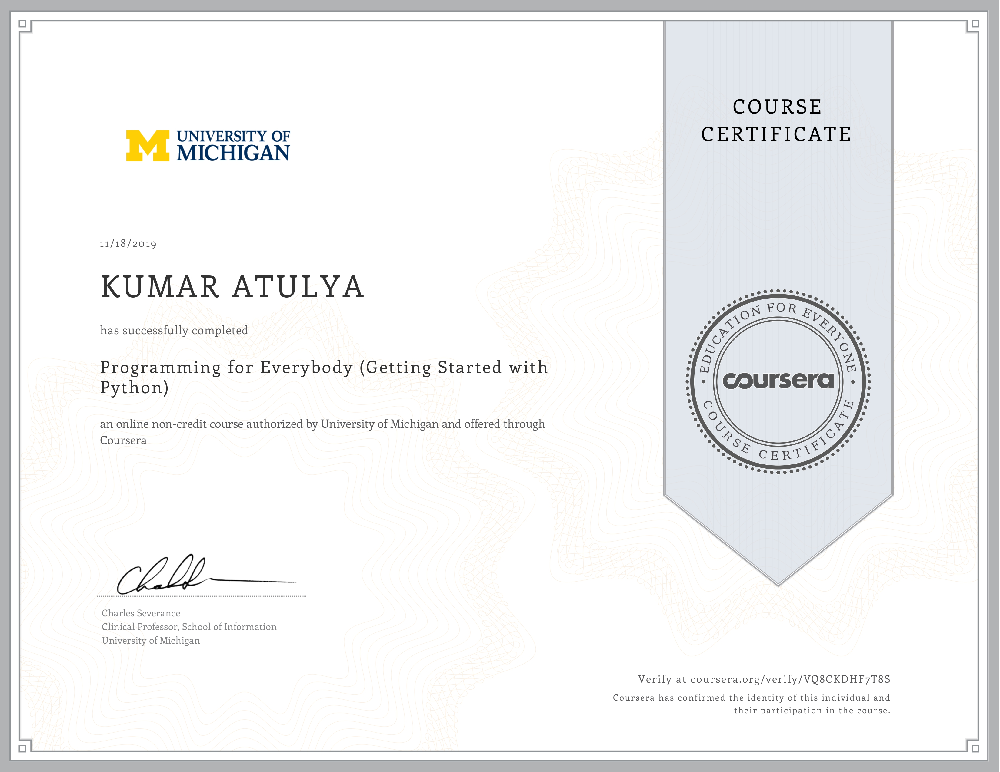
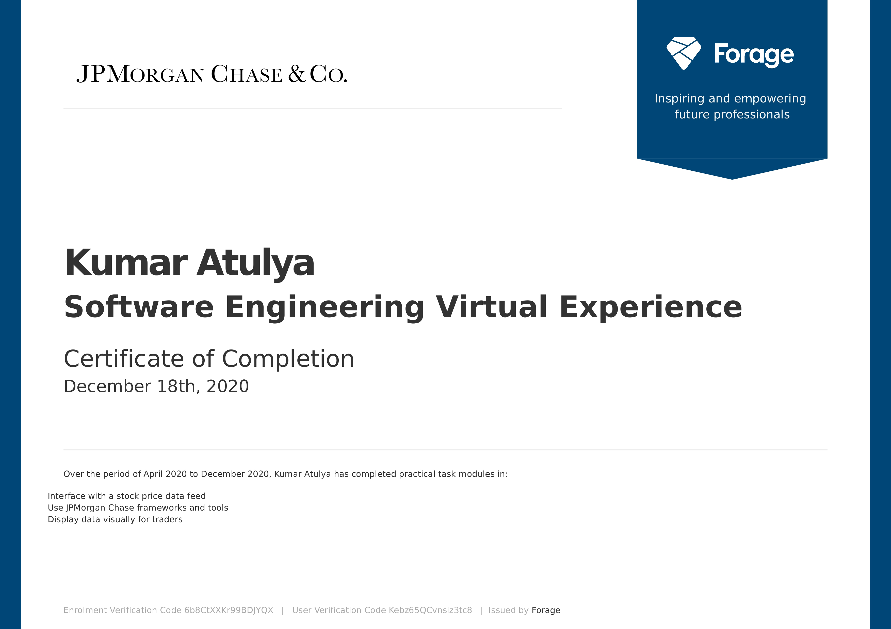
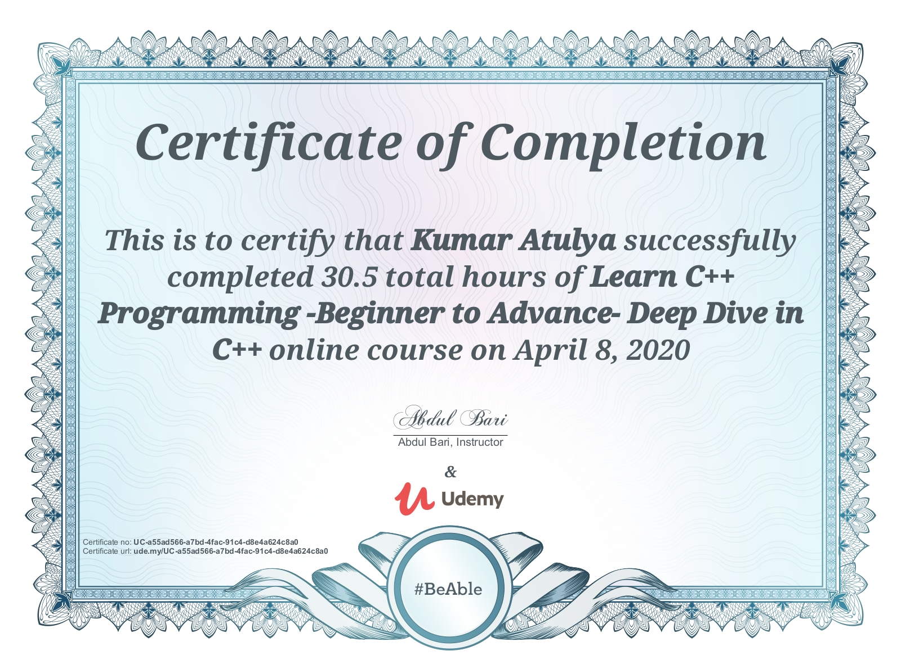
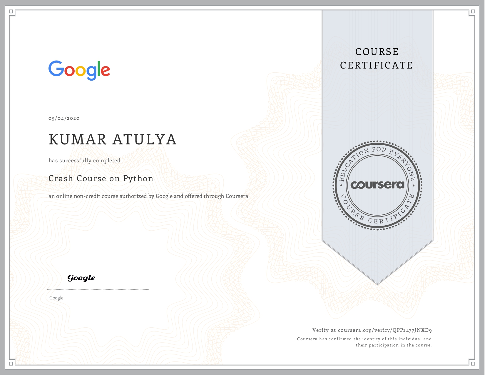

# Certificate Showcase | Kumar Atulya | Encrebidle.eth
This is a showcase of certificates that I have been awarded on completion of several courses, specializations, and MOOCs from different platforms.
Navigate back to [>> Website](https://encrebidle.com) 

### [>>  Google Cloud OnBoard: Application Development] by Google Cloud 

_page-0001.jpg)

### [>>  Rest API (Intermediate) Certification] by Hackerrank

### [>>  Algorithmic Toolbox] by UC San Diego

### [>>  Geoprocessing using Python] by ISRO, IIRS, Dehradun 

### [>>  Mathematical Thinking in Computer Science] by UC San Diego 

### [>>  Programming for Everybody] by University of Michigan

### [>>  Software Engineering Virtual Experience] by JPMorgan Chase & Co. 

### [>>  C++ Programming] by Udemy 

### [>>  Crash Course on Python] by Google 

#### >>>> Please visit [this](verifylink) for verification

### [>>  Geoprocessing using Python](courselink) by ISRO

#### >>>> Please visit [this](verifylink) for verification
